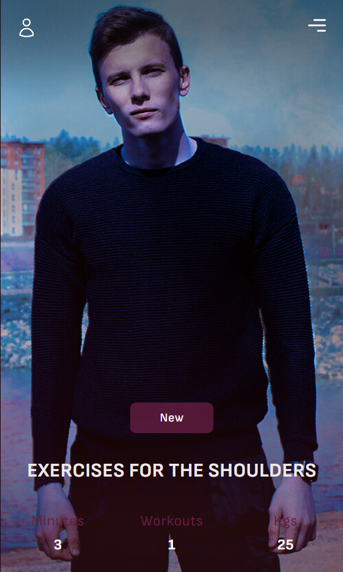
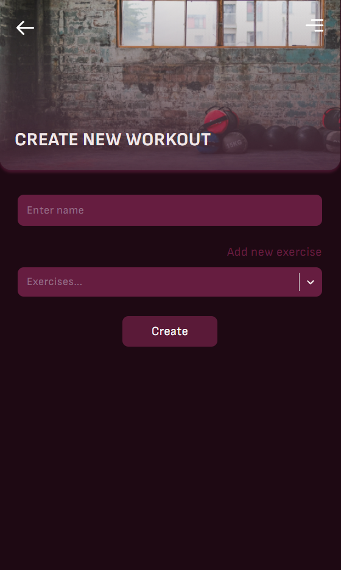
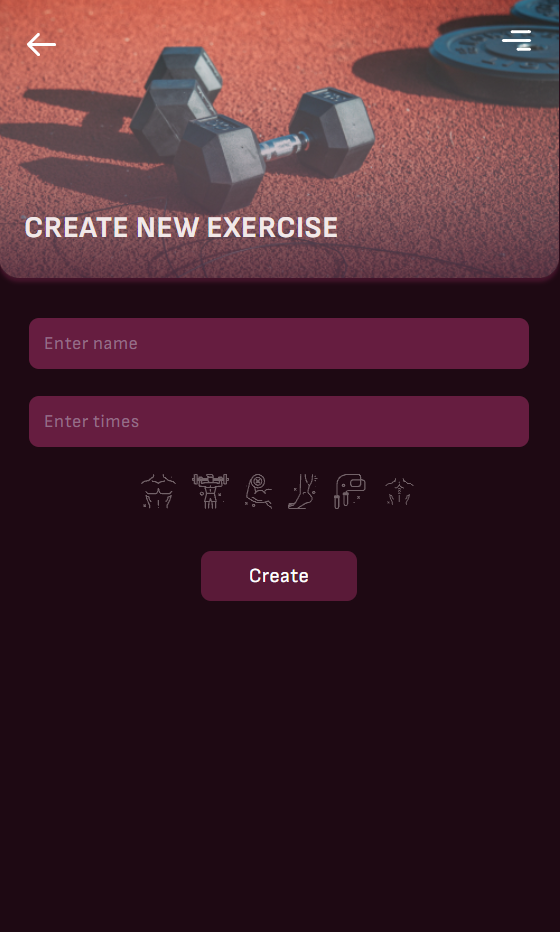

# Workout-App

It is a simple app for workouts. You can use it in a gym or at home.

## Table of Contents

- [Overview](#overview)
  - [Screenshots](#screenshots)
- [About](#about)
  - [Features](#features)
- [Built with](#built-with)

## Overview

### Screenshots

## About

### Features

- Logging in
- Creating workouts
- Creating exercises
- Reading stats

## Built with

- Frontend
  - React
  - React Router
  - React Hook Form
  - React Select
  - React Query
  - Axios
  - JS Cookie
  - Scss
- Backend
  - Express
  - PostgreSQL
  - Prisma
  - Json Webtoken
- Other
  - Vite
  - PG Admin
  - Insomnia
  - Visual Studio Code
